# TinyLLaMA: Custom Language Model Training Pipeline

A complete end-to-end pipeline for training a small-scale language model from scratch, including data collection, preprocessing, tokenization, and training with a LLaMA-inspired architecture.

## 🌟 Features

- **Automated Data Collection**: Scrapes Wikipedia articles and web content
- **Robust Data Preprocessing**: Deduplication, quality filtering, and text cleaning
- **Custom Tokenizer Training**: Uses SentencePiece with BPE encoding
- **Modern Architecture**: Implements LLaMA-inspired features including:
  - RMSNorm for layer normalization
  - Rotary Position Embeddings (RoPE)
  - SwiGLU activation function
  - Multi-head attention with causal masking
- **Training Pipeline**: Complete training loop with validation and checkpointing
- **Inference Engine**: Ready-to-use text generation interface

## 📋 Requirements

### Dependencies

```bash
pip install torch torchvision torchaudio
pip install numpy
pip install sentencepiece
pip install wikipedia-api
pip install beautifulsoup4
pip install requests
pip install tqdm
```

### System Requirements

- **GPU**: CUDA-compatible GPU recommended (training will be very slow on CPU)
- **RAM**: At least 8GB RAM, 16GB+ recommended
- **Storage**: 5-10GB free space for data and model checkpoints
- **Python**: 3.8 or higher

## 🚀 Quick Start

### 1. Install Dependencies

```bash
pip install -r requirements.txt
```

### 2. Run the Complete Pipeline

```bash
python training.py
```

This will execute all phases:
1. Data collection from Wikipedia
2. Data preprocessing and cleaning
3. Tokenizer training
4. Model training
5. Inference testing

### 3. Monitor Training Progress

The script will show progress bars and training metrics:
- Loss values during training
- Learning rate schedules
- Validation performance
- Checkpoint saving

## 📊 Pipeline Overview

### Phase 1: Data Collection
- Scrapes Wikipedia articles related to AI topics
- Collects up to 2000 articles per topic
- Supports custom topic lists and web URL scraping
- Saves raw data in JSON format

### Phase 2: Data Preprocessing
- **Exact Deduplication**: Removes identical content using MD5 hashing
- **Near Deduplication**: Uses Jaccard similarity on text shingles
- **Quality Filtering**: Removes low-quality content based on:
  - Text length (100-50,000 characters)
  - Word count and sentence structure
  - Character diversity

### Phase 3: Tokenizer Training
- Trains SentencePiece tokenizer with BPE algorithm
- Vocabulary size: 12,000 tokens
- Includes special tokens: PAD, EOS, UNK, BOS

### Phase 4: Model Architecture

```
TinyLLaMA Model Specifications:
├── Embedding Dimension: 512
├── Number of Layers: 8
├── Attention Heads: 8
├── Vocabulary Size: 12,000
├── Max Sequence Length: 512
├── Parameters: ~15M
└── Features:
    ├── RMSNorm
    ├── Rotary Position Embeddings
    ├── SwiGLU Activation
    └── Causal Self-Attention
```

### Phase 5: Training Configuration
- **Optimizer**: AdamW with weight decay (0.1)
- **Learning Rate**: 5e-4 with cosine annealing
- **Batch Size**: 8
- **Epochs**: 100
- **Gradient Clipping**: Max norm 1.0
- **Validation Split**: 90/10 train/validation

## 🔧 Configuration

### Customizing Topics

Edit the `topics` list in `main()`:

```python
topics = [
    "artificial intelligence",
    "machine learning",
    "deep learning",
    "neural networks"
]
```

### Model Hyperparameters

Modify the model configuration:

```python
model = TinyLLaMA(
    vocab_size=tokenizer.vocab_size(),
    dim=512,        # Embedding dimension
    n_layers=8,     # Number of transformer layers
    n_heads=8,      # Number of attention heads
    max_seq_len=512, # Maximum sequence length
    dropout=0.1     # Dropout rate
)
```

### Training Parameters

Adjust training settings:

```python
trainer.train(
    train_data, 
    val_data, 
    epochs=100,      # Number of training epochs
    batch_size=8,    # Batch size
    lr=5e-4         # Learning rate
)
```

## 📁 Output Files

After training, you'll have:

```
├── data/
│   ├── wiki_data.json          # Raw scraped data
│   └── clean_data.json         # Preprocessed data
├── tinyllama_tokenizer.model   # Trained tokenizer
├── tinyllama_tokenizer.vocab   # Tokenizer vocabulary
├── tinyllama_final.pt          # Final trained model
└── checkpoint_*.pt             # Training checkpoints
```

## 🎯 Usage Examples

### Text Generation

```python
from training import TinyLLaMAInference

# Load trained model
inference = TinyLLaMAInference(
    model_path="tinyllama_final.pt",
    tokenizer_path="tinyllama_tokenizer.model"
)

# Generate text
response = inference.generate_text(
    prompt="The future of artificial intelligence is",
    max_length=100,
    temperature=0.7,
    top_k=50
)

print(response)
```

### Custom Data Training

```python
# Use your own data
custom_data = [
    {"content": "Your text data here...", "source": "custom"},
    {"content": "More text data...", "source": "custom"}
]

# Train with custom data
trainer = Trainer(model, tokenizer, device)
trainer.train(custom_data, val_data, epochs=50)
```

## 🛠️ Troubleshooting

### Common Issues

**CUDA Out of Memory**
- Reduce batch size: `batch_size=4` or `batch_size=2`
- Reduce sequence length: `max_seq_len=256`
- Use gradient accumulation

**Slow Training**
- Ensure you're using GPU: Check `torch.cuda.is_available()`
- Reduce model size: `dim=256, n_layers=4`
- Use mixed precision training

**Poor Generation Quality**
- Train for more epochs
- Increase model size
- Improve data quality
- Adjust generation parameters (temperature, top_k)

### Memory Optimization

For limited GPU memory:

```python
# Smaller model configuration
model = TinyLLaMA(
    vocab_size=tokenizer.vocab_size(),
    dim=256,        # Reduced dimension
    n_layers=4,     # Fewer layers
    n_heads=4,      # Fewer heads
    max_seq_len=256, # Shorter sequences
    dropout=0.1
)
```

## 📈 Performance Expectations

### Training Time
- **GPU (RTX 3080)**: ~2-4 hours for 100 epochs
- **GPU (GTX 1060)**: ~8-12 hours for 100 epochs  
- **CPU**: Not recommended (days/weeks)

### Model Quality
- **Small Dataset**: Basic coherence, limited knowledge
- **Large Dataset**: Better coherence, domain knowledge
- **Extended Training**: Improved fluency and consistency

## 🤝 Contributing

1. Fork the repository
2. Create a feature branch
3. Make your changes
4. Add tests if applicable
5. Submit a pull request

## 📝 Thank's

Build on **LLama3** style architecture and techniques

## 🙏 Acknowledgments

- Inspired by the LLaMA architecture from Meta AI
- Uses SentencePiece tokenization
- Built with PyTorch framework
- Wikipedia for providing open data

## 📞 Support

For questions and support:
- Open an issue on GitHub
- Check the troubleshooting section
- Review the code comments for implementation details
- Mail us hemanthreddykunduru0701@gmail.com

---
# Sequence Diagram

```mermaid
graph TB
    %% Data Collection Phase
    subgraph DC["🔍 PHASE 1: DATA COLLECTION"]
        DC1[DataCollector Class<br/>📁 output_dir='data']
        DC2[scrape_wikipedia<br/>🌐 Wikipedia API<br/>📊 max_articles=2000/topic<br/>🎯 Topic: 'artificial intelligence']
        DC3[scrape_web_content<br/>🌍 Web URLs scraping<br/>📄 BeautifulSoup parsing<br/>⏱️ timeout=10s]
        DC4[clean_text<br/>🧹 Remove whitespace<br/>🔤 Filter special chars<br/>📏 Min line length=10]
        DC5[save_raw_data<br/>💾 raw_data.json<br/>📈 UTF-8 encoding]
        
        DC1 --> DC2
        DC1 --> DC3
        DC2 --> DC4
        DC3 --> DC4
        DC4 --> DC5
    end

    %% Data Preprocessing Phase
    subgraph DP["🔧 PHASE 2: DATA PREPROCESSING"]
        DP1[DataPreprocessor Class<br/>📂 data_dir='data']
        DP2[load_raw_data<br/>📖 Load raw_data.json]
        DP3[deduplicate_exact<br/>🔐 MD5 hashing<br/>📊 Remove exact matches]
        DP4[deduplicate_near<br/>📐 Jaccard similarity<br/>🔢 k-shingles=3<br/>⚖️ threshold=0.7]
        DP5[quality_filter<br/>📏 Length: 100-50000 chars<br/>📝 Words: >20<br/>📖 Sentence structure<br/>🎨 Character diversity>10]
        DP6[save_processed_data<br/>💾 clean_data.json<br/>✅ High-quality texts]
        
        DP1 --> DP2
        DP2 --> DP3
        DP3 --> DP4
        DP4 --> DP5
        DP5 --> DP6
    end

    %% Tokenization Phase
    subgraph TT["🔤 PHASE 3: TOKENIZER TRAINING"]
        TT1[TokenizerTrainer Class<br/>📊 vocab_size=12000]
        TT2[train_tokenizer<br/>🤖 SentencePiece BPE<br/>🔄 model_type='bpe'<br/>📋 normalization='nfkc']
        TT3[Special Tokens<br/>🔹 PAD_ID=0<br/>🔹 EOS_ID=1<br/>🔹 UNK_ID=2<br/>🔹 BOS_ID=3]
        TT4[tinyllama_tokenizer.model<br/>💾 Trained tokenizer<br/>📊 Vocab size: 12K]
        
        TT1 --> TT2
        TT2 --> TT3
        TT3 --> TT4
    end

    %% Model Architecture Detail
    subgraph MA["🧠 PHASE 4: MODEL ARCHITECTURE"]
        subgraph TME["Token & Position Embeddings"]
            TME1[Token Embedding<br/>📊 vocab_size=12000<br/>➡️ dim=512<br/>🎯 Learnable weights]
        end
        
        subgraph TB["🔄 Transformer Block ×8"]
            TB1[Input: B,T,512]
            TB2[RMSNorm<br/>📐 Root Mean Square<br/>⚡ eps=1e-6<br/>🎛️ Learnable scale]
            TB3[Multi-Head Attention<br/>👥 n_heads=8<br/>📏 head_dim=64<br/>🔄 Q,K,V projections]
            TB4[Rotary Position Encoding<br/>🌀 RoPE for Q,K<br/>📐 base=10000<br/>📏 max_pos=2048]
            TB5[Causal Attention<br/>🔺 Lower triangular mask<br/>⚡ Scaled dot-product<br/>📊 Softmax normalization]
            TB6[Output Projection<br/>🔄 Linear transformation<br/>📊 dim→dim]
            TB7[Residual Connection 1<br/>➕ x + attentionnorm_x]
            TB8[RMSNorm<br/>📐 FFN normalization]
            TB9[SwiGLU Feed Forward<br/>🔀 w1: dim→4*dim<br/>🔀 w2: 4*dim→dim<br/>🔀 w3: dim→4*dim<br/>⚡ SiLU w1_x * w3_x]
            TB10[Residual Connection 2<br/>➕ x + ffn norm_x]
            TB11[Output: B,T,512]
            
            TB1 --> TB2
            TB2 --> TB3
            TB3 --> TB4
            TB4 --> TB5
            TB5 --> TB6
            TB6 --> TB7
            TB7 --> TB8
            TB8 --> TB9
            TB9 --> TB10
            TB10 --> TB11
        end
        
        subgraph FIN["🎯 Final Layers"]
            FIN1[Final RMSNorm<br/>📐 Layer normalization]
            FIN2[Language Model Head<br/>🔄 Linear: dim→vocab_size<br/>📊 No bias<br/>🎯 Logit computation]
            FIN3[Cross-Entropy Loss<br/>📊 Next token prediction<br/>🎯 ignore_index=-1]
            
            FIN1 --> FIN2
            FIN2 --> FIN3
        end
        
        TME1 --> TB1
        TB11 --> FIN1
    end

    %% Dataset and Training
    subgraph DS["📚 DATASET PREPARATION"]
        DS1[TextDataset Class<br/>📄 Text processing<br/>🔤 Tokenization<br/>📏 max_length=512]
        DS2[Data Splitting<br/>🎯 Train: 90%<br/>✅ Validation: 10%<br/>🔀 Shuffle enabled]
        DS3[DataLoader<br/>📦 batch_size=8<br/>🔀 shuffle=True<br/>⚡ Efficient batching]
        DS4[Input Sequences<br/>📊 x: tokens :-1<br/>🎯 y: tokens 1: <br/>🔄 Shifted targets]
        
        DS1 --> DS2
        DS2 --> DS3
        DS3 --> DS4
    end

    %% Training Pipeline
    subgraph TR["🏋️ PHASE 5: TRAINING PIPELINE"]
        TR1[Trainer Class<br/>🖥️ Device: CUDA/CPU<br/>📊 Model parameters: ~24M]
        TR2[AdamW Optimizer<br/>📈 lr=5e-4<br/>⚖️ weight_decay=0.1<br/>🎯 Beta parameters]
        TR3[Cosine Annealing LR<br/>📉 T_max=total_steps<br/>🔄 Smooth decay<br/>📊 Min lr approaches 0]
        TR4[Training Loop<br/>🔄 epochs=100<br/>💾 save_every=1000<br/>📊 Progress tracking]
        
        subgraph TS["🔄 Training Step Detail"]
            TS1[Forward Pass<br/>📊 Compute logits<br/>📈 Calculate loss<br/>🎯 Causal LM objective]
            TS2[Backward Pass<br/>🔄 loss.backward<br/>📊 Gradient computation<br/>⚡ Automatic differentiation]
            TS3[Gradient Clipping<br/>✂️ max_norm=1.0<br/>🛡️ Prevent explosion<br/>📊 L2 norm clipping]
            TS4[Parameter Update<br/>📈 optimizer.step<br/>🔄 Weight adjustment<br/>⚡ AdamW mechanics]
            TS5[LR Scheduling<br/>📉 scheduler.step<br/>🔄 Learning rate decay<br/>📊 Cosine annealing]
            TS6[Validation<br/>✅ Eval mode<br/>📊 No gradients<br/>📈 Track val_loss]
            TS7[Checkpointing<br/>💾 Save model state<br/>📋 Save config<br/>🔄 Resume capability]
            
            TS1 --> TS2
            TS2 --> TS3
            TS3 --> TS4
            TS4 --> TS5
            TS5 --> TS6
            TS6 --> TS7
        end
        
        TR1 --> TR2
        TR2 --> TR3
        TR3 --> TR4
        TR4 --> TS1
    end

    %% Inference Pipeline
    subgraph INF["🚀 PHASE 6: INFERENCE PIPELINE"]
        INF1[TinyLLaMAInference<br/>📋 Load checkpoint<br/>🔤 Load tokenizer<br/>🖥️ Set device]
        INF2[Model Loading<br/>📊 Restore state_dict<br/>⚙️ Apply config<br/>🔄 Set eval mode]
        INF3[Text Generation<br/>🎯 Autoregressive<br/>🔄 One token at a time<br/>📏 Max sequence length]
        
        subgraph GEN["🎨 Generation Process"]
            GEN1[Input Processing<br/>🔤 Tokenize prompt<br/>📊 Convert to tensor<br/>🖥️ Move to device]
            GEN2[Forward Pass<br/>📊 Model inference<br/>🎯 Get logits<br/>📈 No gradients]
            GEN3[Temperature Scaling<br/>🌡️ logits / temperature<br/>🎯 Control randomness<br/>📊 Default: 0.7]
            GEN4[Top-k Filtering<br/>🔝 Keep top k tokens<br/>📊 Default: k=50<br/>✂️ Mask others to -inf]
            GEN5[Sampling<br/>🎲 Multinomial sampling<br/>📊 Probability distribution<br/>🔄 Random selection]
            GEN6[Token Append<br/>➕ Add to sequence<br/>🔄 Continue generation<br/>📏 Check max length]
            GEN7[Stopping Criteria<br/>🛑 Max length reached<br/>🔚 EOS token found<br/>⏹️ User termination]
            GEN8[Decoding<br/>🔤 Tokens to text<br/>📝 SentencePiece decode<br/>✨ Final output]
            
            GEN1 --> GEN2
            GEN2 --> GEN3
            GEN3 --> GEN4
            GEN4 --> GEN5
            GEN5 --> GEN6
            GEN6 --> GEN7
            GEN7 --> GEN8
            GEN6 -.->|Continue| GEN2
        end
        
        INF1 --> INF2
        INF2 --> INF3
        INF3 --> GEN1
    end

    %% Model Specifications
    subgraph SPECS["📊 MODEL SPECIFICATIONS"]
        SPEC1[Architecture Details<br/>🧠 Parameters: ~24M<br/>📊 Vocabulary: 12,000<br/>📐 Hidden dim: 512<br/>🔄 Layers: 8<br/>👥 Attention heads: 8<br/>📏 Max sequence: 512<br/>🎯 Context window: 512]
        
        SPEC2[Training Configuration<br/>📚 Data: AI Wikipedia<br/>📄 Articles: ~2000<br/>🔄 Epochs: 100<br/>📦 Batch size: 8<br/>📈 Learning rate: 5e-4<br/>⚖️ Weight decay: 0.1<br/>🎯 Optimizer: AdamW]
        
        SPEC3[Performance Metrics<br/>💾 Memory: ~4GB GPU<br/>⏱️ Training time: Hours<br/>🚀 Inference: Real-time<br/>📊 Loss convergence<br/>✨ Text quality<br/>🎯 Coherence score]
        
        SPEC4[Technical Features<br/>🌀 Rotary embeddings<br/>📐 RMS normalization<br/>⚡ SwiGLU activation<br/>🔺 Causal attention<br/>✂️ Gradient clipping<br/>📉 LR scheduling]
    end

    %% Main Execution Flow
    subgraph MAIN["🎬 MAIN EXECUTION FLOW"]
        MAIN1[main Function<br/>🖥️ Device selection<br/>🎯 CUDA/CPU detection<br/>📊 Memory check]
        MAIN2[Sequential Execution<br/>1️⃣ Data collection<br/>2️⃣ Preprocessing<br/>3️⃣ Tokenizer training<br/>4️⃣ Model training<br/>5️⃣ Inference testing<br/>✅ Complete pipeline]
        MAIN3[Output Artifacts<br/>💾 tinyllama_final.pt<br/>🔤 tinyllama_tokenizer.model<br/>📊 Training logs<br/>💹 Checkpoints<br/>📋 Configuration files]
        
        MAIN1 --> MAIN2
        MAIN2 --> MAIN3
    end

    %% Data Flow Connections
    DC5 -.->|raw_data.json| DP2
    DP6 -.->|clean_data.json| TT2
    TT4 -.->|tokenizer.model| DS1
    DS4 -.->|batched_data| TR4
    TR4 -.->|trained_model| INF1
    
    %% Control Flow
    MAIN1 --> DC1
    DC5 --> DP1
    DP6 --> TT1
    TT4 --> DS1
    DS4 --> TR1
    TR4 --> INF1

    %% Elegant Light Color Styling
    classDef dataCollection fill:#e8f4fd,stroke:#1565c0,stroke-width:2px,color:#0d47a1
    classDef preprocessing fill:#f1f8e9,stroke:#558b2f,stroke-width:2px,color:#2e7d32
    classDef tokenization fill:#fce4ec,stroke:#c2185b,stroke-width:2px,color:#ad1457
    classDef architecture fill:#f3e5f5,stroke:#7b1fa2,stroke-width:2px,color:#6a1b9a
    classDef training fill:#fff8e1,stroke:#ff8f00,stroke-width:2px,color:#e65100
    classDef inference fill:#e0f2f1,stroke:#00695c,stroke-width:2px,color:#004d40
    classDef specs fill:#fafafa,stroke:#424242,stroke-width:2px,color:#212121
    classDef main fill:#e8eaf6,stroke:#3f51b5,stroke-width:2px,color:#303f9f
    classDef process fill:#fff3e0,stroke:#f57c00,stroke-width:1px,color:#ef6c00
    classDef component fill:#f9fbe7,stroke:#827717,stroke-width:1px,color:#689f38

    %% Apply styles to phases
    class DC,DC1,DC2,DC3,DC4,DC5 dataCollection
    class DP,DP1,DP2,DP3,DP4,DP5,DP6 preprocessing
    class TT,TT1,TT2,TT3,TT4 tokenization
    class MA,TME,TME1,TB,TB1,TB2,TB3,TB4,TB5,TB6,TB7,TB8,TB9,TB10,TB11,FIN,FIN1,FIN2,FIN3 architecture
    class TR,TR1,TR2,TR3,TR4,DS,DS1,DS2,DS3,DS4 training
    class INF,INF1,INF2,INF3,GEN,GEN1,GEN2,GEN3,GEN4,GEN5,GEN6,GEN7,GEN8 inference
    class SPECS,SPEC1,SPEC2,SPEC3,SPEC4 specs
    class MAIN,MAIN1,MAIN2,MAIN3 main
    class TS,TS1,TS2,TS3,TS4,TS5,TS6,TS7 process
```

